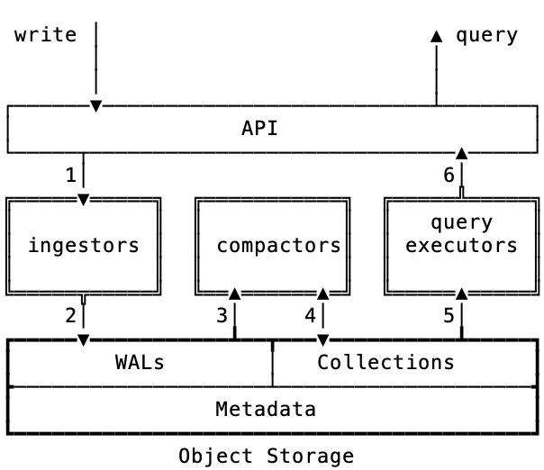

# Overview

OpenData is a collection of open source data infrastructure projects designed from ground up for objectstoraege. We aim to deliver highly focused, objectstore-native versions of online databases that can power your application stack. As of today, we have a competitive timeseries database and a data streaming backend. We plan to ship vector search, text search, and other database types over time. Contributions are welcome!

Building performant, cost effective, and correct online systems on objectstorage takes special care. Successful designs all have to solve the problem of write batching, multiple levels of caching, and snapshot isolation for correctness. OpenData systems build on a common foundation to solve these problems. This common foundation gives OpenData systems a common set of operational tools, configuration systems, etc., that make our systems easier to operate in aggregate. 

# Architecture

Each OpenData product has a high level architecture that looks like this:

## Data Flow
The core concepts are best understood by following the typical data flow.

1. The API layer is specific to each product, and implements the appropriate read and write APIs for the product. When the API layer receives write requests, they are forwarded to the Ingestor services.
2. The Ingestor services are stateless. They batch writes coming from the API layer, flush the data in a Write-Ahead-Log (WAL) format which is optimized for object storage, and update Metadata. We describe the metadata layer in detail later, but for now it suffices to know that the matadata contains locations and versions of all files in the system. The metadata lives in objectstorage, and all OpenData systems use the same components to enable writing metadata updates atomically. Atomic updates to metadata ensure that readers and writers in the system operate on consistent views of the data in the system.
3. There are two types of Compactors in the OpenData system. One type is called the WAL compactor. It takes new WAL files written by ingestors and write the WAL entries into a format that's optimized to serve the queries of each data system. For example, a compactor for a TSDB will take a WAL file and write inverted indexes, dictionaries, etc. These read-optimized files are called Collections. 
4. The other type of Compactor takes existing Collections and rewrites them for various reasons, including to drop deleted data, to improve data locality across updates, etc. This logic is again product specific. The goal of the background compaction process is to maintain read optimized versions of the data across updates. 
5. The query executors are responsible for serving queries on the system. These are custom for each product type. For instance, the query executor of our TSDB implements PromQL. When executing a query, the executors lookup the metadata to find the files relevant to serving the query, and retrieves the data from those files. A big job of the query executor is to keep the right indexes in memory and the hot data cached so that queries on the system are both fast and do not create unduly expensive calls to the objectstore.
6. The API layer forwards queries to the query executors for compliation and execution, and returns results to clients. 

## Shared components

TODO, but a sketch of the content is: 

1. OpenData leverages SlateDB's compactor framework, caching algorithms, and objectstore-native LSM file format.
2. OpenData relies completely on SlateDB's manifest implementation for reading and writing metadata.
3. OpenData relies on SlateDB's WAL format as an performant objectstore-native WAL.
4. On the query side, OpenData leverages Datafusion to build performant and functional query engines. 

As a general principle, we prefer common data and query components to be part of SlateDB and Datafusion respectively.

## Metadata 

TODO, but here's a sketch:

1. The metadata layer leverages SlateDB's [manifest](https://github.com/slatedb/slatedb/blob/main/rfcs/0001-manifest.md). The manifest contains the locations of all the files that comprise the data in the system. 
2. The general principle is that data is only read if the files are accessible via the manifest. 
3. SlateDB leverages compare-and-set operations that are available in every object store to atomically updatet the manifest.
4. Ingestors and Compactors flush data to objectstore, and then atomically update the locations in the manifest.
5. SlateDB further versions the metadata using epochs, which ensures that zombie writers can't roll versions back.
6. Readers of data, including Compactors and Query Executors, thus always get a consistent view of the metadata at any point in time. 
7. This allows basic snapshot isolation across reads and writes. 

# Our systems.

OpenData ships two systems today:

* TSDB: An objectstore native timeseries database that can serve as a backend for Prometheus. Its a great option for a low cost, easy to operate, grafana backend. Learn more about it here : <link to RFC>
* EventStore: Think of it as Kafka 2.0. An objecstore native event streaming backend that supports millions of logs, so you can finally get a replayable log per key. Learn more about it here: <link to rfc>

# Quick Start

TODO.

# Why OpenData?

## Our Beliefs 

1. We believe that object storage is a fundamentally new ingredient in data systems: it provides highly durable, highly available, infinite storage with unique performance and cost structures. On the one hand, it solves one of the hardest problems in distributed data systems: consistent replication. On the other hand, care must be taken to make it work corretly, performantly, and cost effectively. It turns out that the techniques to achieve the latter are pretty similar across systems: batching on writes, caching on reads, snapshot isolation. When done right, systems built natively on object storage are far simpler and cheaper to operate in modern clouds than those that haven't used object storage as a starting point.
2. Inspired by the UNIX philosophy, we believe single purpose systems that compose well are superior to systems that try to solve many problems under one umbrella.
3. We believe that there is a general lack of objectstore native open source data systems, to the detriment of the developer community at large. 

## Our Vision

To address these structural problems with opensource data infrastructure today, OpenData systems adopt the following principles: 

1. Each OpenData product will target one core use case and aim to be best-in-class at it. 
2. Each OpenData product will be designed from ground up with object storage as a starting point.
3. Each OpenData product will be built on a common set of primitives. One set of primitives is [SlateDB](https://www.slatedb.io), but there may be others. 
4. Each product and every common component will be licensed under the MIT license. 
5. All OpenData products will be built with a uniform operational experience, which includes common CLI tooling, common versioning schemes, common configuration styles, and more.
6. Every OpenData product will be designed to compose with the others. 

OpenData aims to put control back in the hands of developers. Your data is always in your custody, and OpenData makes it practical to serve that data to any app without needing multiple specialist engineers on staff.

# License

MIT License
